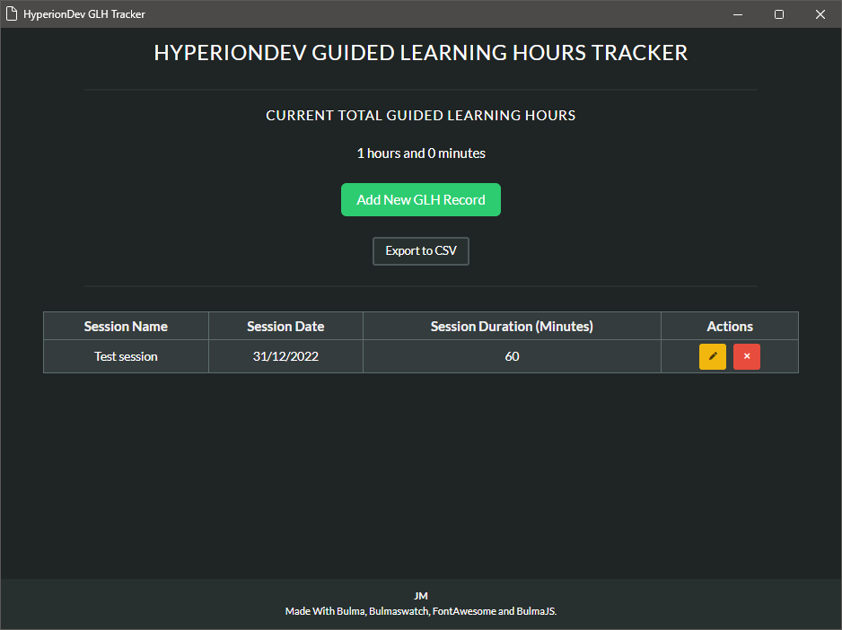

# hdev-glh-tracker
A guided learning hours tracker for the HyperionDev software engineering course.

Uses flask combined with flaskwebui for the user interface.



First:
```
pip install requirements.txt
```

Then run wsgi.py

